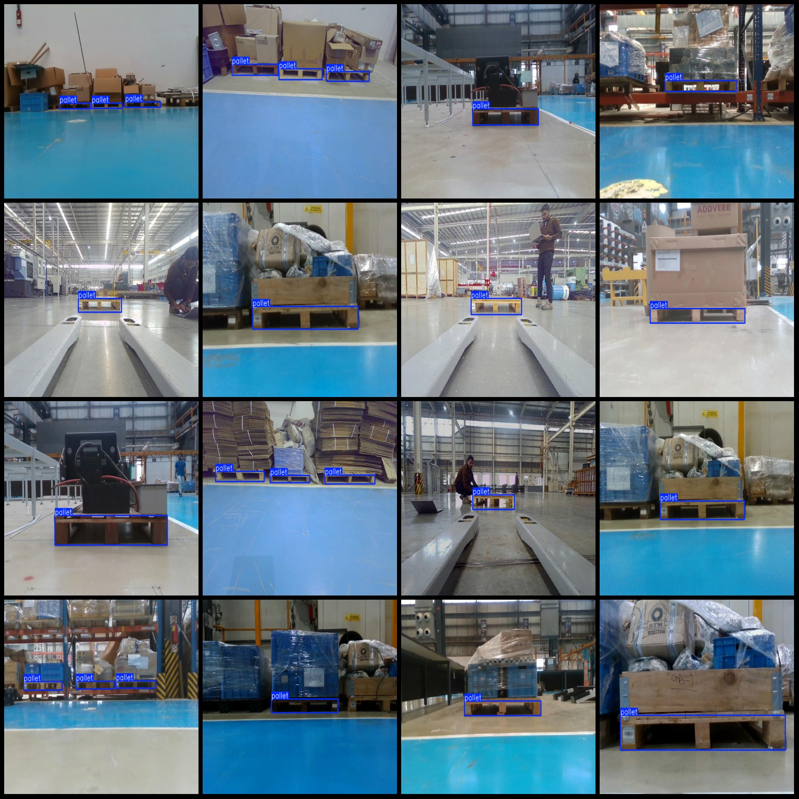
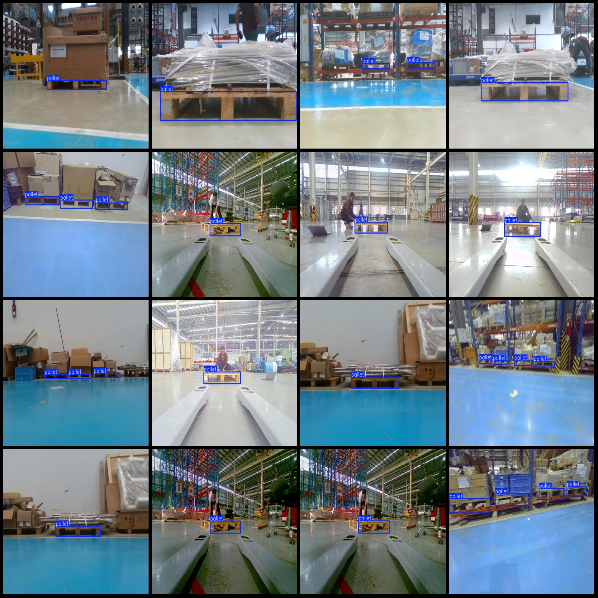

# Pascal VOC + YOLO format dataset with 4517 images in one category

Dataset format: Pascal VOC format + YOLO format (txt file without split path, only contain jpg images and corresponding VOC format xml files and yolo format txt files)
Number of images (jpg file count): 4571
Number of annotations (xml file count): 4571
Number of annotations (txt file count): 4571
Number of annotation categories: 1
Annotation category names: ["pallet"]
Number of boxes for each category: 
Pallet boxes = 6491
Total boxes: 6491
Image resolution: 640x480
Labeling tool used: labelImg
Annotation rules: draw a rectangle around the category
Important notes: None
Special declaration: This dataset does not guarantee the accuracy of the trained model or weight files.
Preview of images:
## Images

Here is a pay link on Stripe ( https://buy.stripe.com/3cs8yP7sY87d0vu9AB ). Please contact me lonlonago@foxmail.com after funding $89, and I will send you a complete data files , thank you!

